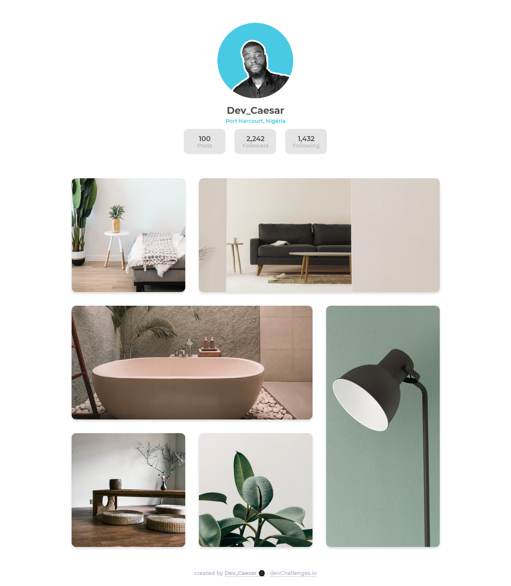
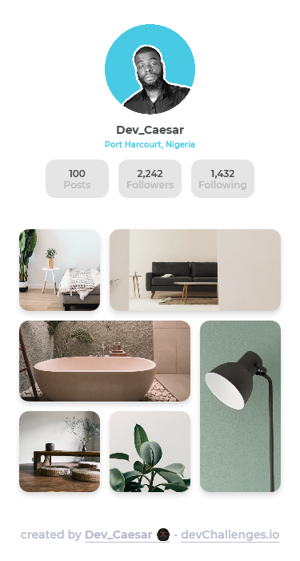

<!-- Please update value in the {}  -->

<h1 align="center">{Gallery Page}</h1>

   Solution for a challenge from  <a href="http://devchallenges.io" target="_blank">Devchallenges.io</a>.

  <h3>
    <a href="https://my-gallery-page-kappa.vercel.app/">
      Demo
    </a>
     | 
    <a href="https://github.com/Dev-Caesar/my-gallery-page">
      Solution
    </a>
     | 
    <a href="https://devchallenges.io/challenges/gcbWLxG6wdennelX7b8I">
      Challenge
    </a>
  </h3>

## Overview

## Contact

- GitHub [@dev_caesar](https://{github.com/dev_caesar})
- Twitter [@dev-caesar](https://{twitter.com/dev-caesar})
